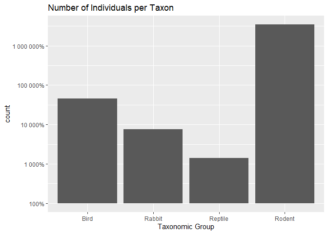
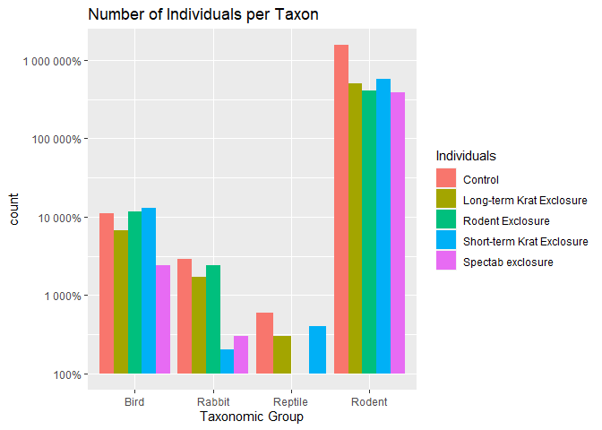
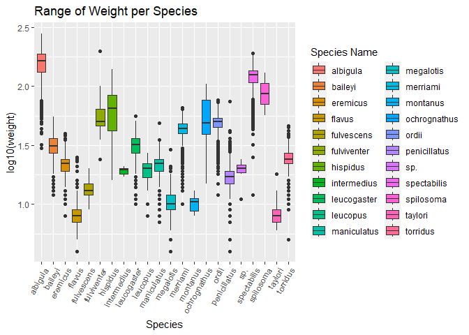
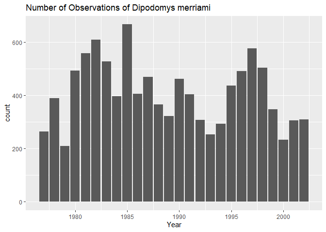

## Instructions
Answer the following questions and complete the exercises in RMarkdown. Please embed all of your code and push your final work to your repository. Your final lab report should be organized, clean, and run free from errors. Remember, you must remove the `#` for the included code chunks to run. Be sure to add your name to the author header above. For any included plots, make sure they are clearly labeled. You are free to use any plot type that you feel best communicates the results of your analysis.  

Make sure to use the formatting conventions of RMarkdown to make your report neat and clean!  

## Load the libraries

```r
library(tidyverse)
library(janitor)
library(naniar)
```

## Desert Ecology
For this assignment, we are going to use a modified data set on [desert ecology](http://esapubs.org/archive/ecol/E090/118/). The data are from: S. K. Morgan Ernest, Thomas J. Valone, and James H. Brown. 2009. Long-term monitoring and experimental manipulation of a Chihuahuan Desert ecosystem near Portal, Arizona, USA. Ecology 90:1708.

```r
deserts <- read_csv("lab11/data/surveys_complete.csv") %>% clean_names()
```

```
## Rows: 34786 Columns: 13
## ── Column specification ────────────────────────────────────────────────────────
## Delimiter: ","
## chr (6): species_id, sex, genus, species, taxa, plot_type
## dbl (7): record_id, month, day, year, plot_id, hindfoot_length, weight
## 
## ℹ Use `spec()` to retrieve the full column specification for this data.
## ℹ Specify the column types or set `show_col_types = FALSE` to quiet this message.
```

1. Use the function(s) of your choice to get an idea of its structure, including how NA's are treated. Are the data tidy?  

## Yes, the data is tidy.


```r
glimpse(deserts)
```

```
## Rows: 34,786
## Columns: 13
## $ record_id       <dbl> 1, 2, 3, 4, 5, 6, 7, 8, 9, 10, 11, 12, 13, 14, 15, 16,…
## $ month           <dbl> 7, 7, 7, 7, 7, 7, 7, 7, 7, 7, 7, 7, 7, 7, 7, 7, 7, 7, …
## $ day             <dbl> 16, 16, 16, 16, 16, 16, 16, 16, 16, 16, 16, 16, 16, 16…
## $ year            <dbl> 1977, 1977, 1977, 1977, 1977, 1977, 1977, 1977, 1977, …
## $ plot_id         <dbl> 2, 3, 2, 7, 3, 1, 2, 1, 1, 6, 5, 7, 3, 8, 6, 4, 3, 2, …
## $ species_id      <chr> "NL", "NL", "DM", "DM", "DM", "PF", "PE", "DM", "DM", …
## $ sex             <chr> "M", "M", "F", "M", "M", "M", "F", "M", "F", "F", "F",…
## $ hindfoot_length <dbl> 32, 33, 37, 36, 35, 14, NA, 37, 34, 20, 53, 38, 35, NA…
## $ weight          <dbl> NA, NA, NA, NA, NA, NA, NA, NA, NA, NA, NA, NA, NA, NA…
## $ genus           <chr> "Neotoma", "Neotoma", "Dipodomys", "Dipodomys", "Dipod…
## $ species         <chr> "albigula", "albigula", "merriami", "merriami", "merri…
## $ taxa            <chr> "Rodent", "Rodent", "Rodent", "Rodent", "Rodent", "Rod…
## $ plot_type       <chr> "Control", "Long-term Krat Exclosure", "Control", "Rod…
```


```r
head(deserts)
```

```
## # A tibble: 6 × 13
##   record_id month   day  year plot_id species_id sex   hindfoot_length weight
##       <dbl> <dbl> <dbl> <dbl>   <dbl> <chr>      <chr>           <dbl>  <dbl>
## 1         1     7    16  1977       2 NL         M                  32     NA
## 2         2     7    16  1977       3 NL         M                  33     NA
## 3         3     7    16  1977       2 DM         F                  37     NA
## 4         4     7    16  1977       7 DM         M                  36     NA
## 5         5     7    16  1977       3 DM         M                  35     NA
## 6         6     7    16  1977       1 PF         M                  14     NA
## # ℹ 4 more variables: genus <chr>, species <chr>, taxa <chr>, plot_type <chr>
```


2. How many genera and species are represented in the data? What are the total number of observations? Which species is most/ least frequently sampled in the study?


```r
deserts %>% 
  count(genus, species, record_id, sort=T) %>% 
  summarize(n_distinct(genus),
            n_distinct(species),
            n_distinct(record_id))
```

```
## # A tibble: 1 × 3
##   `n_distinct(genus)` `n_distinct(species)` `n_distinct(record_id)`
##                 <int>                 <int>                   <int>
## 1                  26                    40                   34786
```


```r
deserts %>%
  count(species, sort=T) %>% 
  arrange(desc(n))
```

```
## # A tibble: 40 × 2
##    species          n
##    <chr>        <int>
##  1 merriami     10596
##  2 penicillatus  3123
##  3 ordii         3027
##  4 baileyi       2891
##  5 megalotis     2609
##  6 spectabilis   2504
##  7 torridus      2249
##  8 flavus        1597
##  9 eremicus      1299
## 10 albigula      1252
## # ℹ 30 more rows
```


3. What is the proportion of taxa included in this study? Show a table and plot that reflects this count.


```r
deserts %>% 
  tabyl(taxa)
```

```
##     taxa     n      percent
##     Bird   450 0.0129362387
##   Rabbit    75 0.0021560398
##  Reptile    14 0.0004024608
##   Rodent 34247 0.9845052607
```


```r
deserts %>% 
  ggplot(aes(x=taxa))+ 
  geom_bar(position="dodge")+
  scale_y_log10(labels = scales::percent)+
  labs(title="Number of Individuals per Taxon", 
       x="Taxonomic Group")
```

<!-- -->


4. For the taxa included in the study, use the fill option to show the proportion of individuals sampled by `plot_type.`


```r
deserts %>% 
  ggplot(aes(x=taxa, fill=plot_type))+ 
  geom_bar(position="dodge")+
  scale_y_log10(labels = scales::percent)+
  labs(title="Number of Individuals per Taxon", 
       x="Taxonomic Group",
       fill="Individuals")
```

<!-- -->


5. What is the range of weight for each species included in the study? Remove any observations of weight that are NA so they do not show up in the plot.


```r
deserts %>% 
  filter(!weight=="NA") %>% 
  ggplot(aes(x=species, y=log10(weight), fill=species))+
  geom_boxplot(position="dodge")+
  theme(axis.text.x=element_text(angle=60, hjust = 1))+
  labs(title="Range of Weight per Species", 
       x="Species",
       fill="Species Name")
```

<!-- -->


6. Add another layer to your answer from #5 using `geom_point` to get an idea of how many measurements were taken for each species.


```r
deserts %>% 
  filter(!weight=="NA") %>% 
  ggplot(aes(x=species, y=log10(weight), fill=species))+
  geom_boxplot(position="dodge")+
  theme(axis.text.x=element_text(angle=60, hjust = 1))+
  labs(title="Range of Weight per Species", 
       x="Species",
       fill="Species Name")+
  geom_point()
```

<!-- -->


7. [Dipodomys merriami](https://en.wikipedia.org/wiki/Merriam's_kangaroo_rat) is the most frequently sampled animal in the study. How have the number of observations of this species changed over the years included in the study?


```r
deserts %>% 
  select(genus, species, year) %>% 
  filter(genus=="Dipodomys", species=="merriami") %>%
  group_by(year) %>% 
  count(genus, species) %>% 
  arrange(desc(n))
```

```
## # A tibble: 26 × 4
## # Groups:   year [26]
##     year genus     species      n
##    <dbl> <chr>     <chr>    <int>
##  1  1985 Dipodomys merriami   667
##  2  1982 Dipodomys merriami   609
##  3  1997 Dipodomys merriami   576
##  4  1981 Dipodomys merriami   559
##  5  1983 Dipodomys merriami   528
##  6  1998 Dipodomys merriami   503
##  7  1980 Dipodomys merriami   493
##  8  1996 Dipodomys merriami   492
##  9  1987 Dipodomys merriami   469
## 10  1990 Dipodomys merriami   462
## # ℹ 16 more rows
```


```r
deserts %>% 
  select(genus, species, year) %>% 
  filter(genus=="Dipodomys", species=="merriami") %>%
  ggplot(aes(x=year))+
  geom_bar()+
  labs(title="Number of Observations of Dipodomys merriami", 
       x="Year")
```

<!-- -->


8. What is the relationship between `weight` and `hindfoot` length? Consider whether or not over plotting is an issue. 
## There is definitely an issue with over plotting.


```r
deserts %>% 
  ggplot(aes(x=log10(weight), y=log10(hindfoot_length)))+
  geom_jitter(na.rm=T)+
  labs(title="Weight vs. Hindfoot Length", 
       x="Log10 Weight",
       y="Log10 Hindfoot Length")
```

<!-- -->


9. Which two species have, on average, the highest weight? Once you have identified them, make a new column that is a ratio of `weight` to `hindfoot_length`. Make a plot that shows the range of this new ratio and fill by sex.


```r
deserts %>%
  select(species, weight) %>% 
  filter(!weight=="NA") %>% 
  group_by(species) %>% 
  summarize(average=mean(weight)) %>% 
  arrange(desc(average))
```

```
## # A tibble: 22 × 2
##    species      average
##    <chr>          <dbl>
##  1 albigula       159. 
##  2 spectabilis    120. 
##  3 spilosoma       93.5
##  4 hispidus        65.6
##  5 fulviventer     58.9
##  6 ochrognathus    55.4
##  7 ordii           48.9
##  8 merriami        43.2
##  9 baileyi         31.7
## 10 leucogaster     31.6
## # ℹ 12 more rows
```


```r
deserts %>%
  select(species, weight, hindfoot_length) %>% 
  filter(!weight=="NA") %>% 
  group_by(species) %>% 
  summarize(average=mean(weight),
            average2=mean(hindfoot_length, na.rm=T)) %>% 
  mutate(ratio_weight_to_hindfoot_length = average/average2)
```

```
## # A tibble: 22 × 4
##    species     average average2 ratio_weight_to_hindfoot_length
##    <chr>         <dbl>    <dbl>                           <dbl>
##  1 albigula     159.       32.3                           4.94 
##  2 baileyi       31.7      26.1                           1.22 
##  3 eremicus      21.6      20.2                           1.07 
##  4 flavus         7.92     15.6                           0.509
##  5 fulvescens    13.4      17.5                           0.764
##  6 fulviventer   58.9      26.7                           2.21 
##  7 hispidus      65.6      28.1                           2.34 
##  8 intermedius   19.2      22.1                           0.870
##  9 leucogaster   31.6      20.5                           1.54 
## 10 leucopus      19.1      20.0                           0.956
## # ℹ 12 more rows
```


```r
deserts %>% 
  filter(!sex=="NA") %>% 
  group_by(species) %>%
  mutate(average1=mean(weight, na.rm=T),
         average2=mean(hindfoot_length, na.rm=T)) %>% 
  ggplot(aes(x=average1, y=average2, color=sex))+
  geom_point(na.rm=T)+
  labs(title="Average Weight vs. Average Hindfoot Length", 
       x="Average Weight",
       y="Average Hindfoot Length",
       color="Sex")
```

<!-- -->


10. Make one plot of your choice! Make sure to include at least two of the aesthetics options you have learned.


```r
deserts %>% 
  ggplot(aes(x=species, fill=genus))+
  geom_bar()+
  labs(title="Observations of Species", 
       x="Species",
       y="Number of Observations",
       fill="Genus")+
  coord_flip()+
  scale_y_log10()
```

<!-- -->


## Push your final code to GitHub!
Please be sure that you check the `keep md` file in the knit preferences. 
