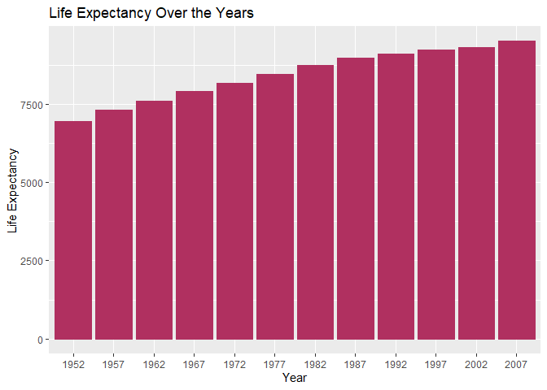
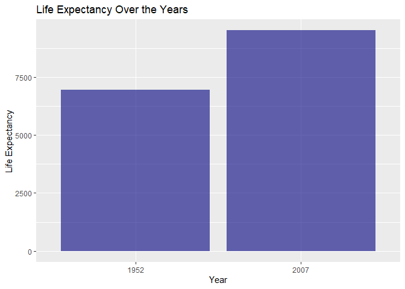
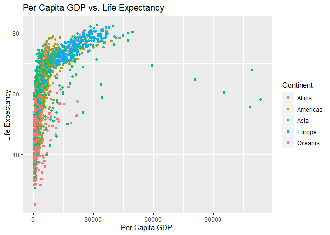
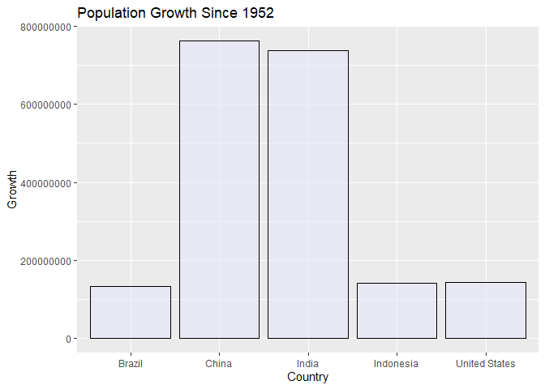
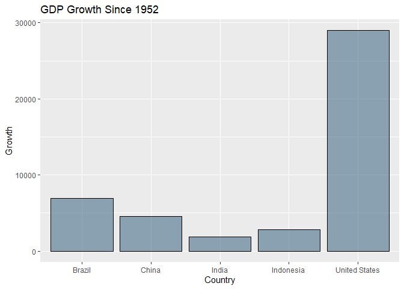
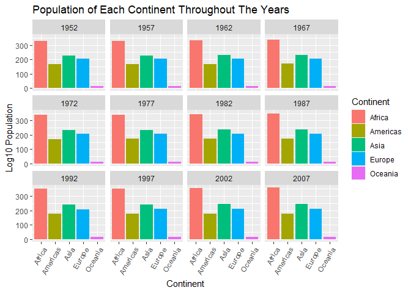

## Instructions
Answer the following questions and complete the exercises in RMarkdown. Please embed all of your code and push your final work to your repository. Your final lab report should be organized, clean, and run free from errors. Remember, you must remove the `#` for the included code chunks to run. Be sure to add your name to the author header above. For any included plots, make sure they are clearly labeled. You are free to use any plot type that you feel best communicates the results of your analysis.  

**In this homework, you should make use of the aesthetics you have learned. It's OK to be flashy!**

Make sure to use the formatting conventions of RMarkdown to make your report neat and clean!  

## Load the libraries

```r
library(tidyverse)
library(janitor)
library(here)
library(naniar)
```


```r
options(scipen = 999)
```

## Resources
The idea for this assignment came from [Rebecca Barter's](http://www.rebeccabarter.com/blog/2017-11-17-ggplot2_tutorial/) ggplot tutorial so if you get stuck this is a good place to have a look.  

## Gapminder
For this assignment, we are going to use the dataset [gapminder](https://cran.r-project.org/web/packages/gapminder/index.html). Gapminder includes information about economics, population, and life expectancy from countries all over the world. You will need to install it before use. This is the same data that we will use for midterm 2 so this is good practice.

```r
#install.packages("gapminder")
library("gapminder")
```

## Questions
The questions below are open-ended and have many possible solutions. Your approach should, where appropriate, include numerical summaries and visuals. Be creative; assume you are building an analysis that you would ultimately present to an audience of stakeholders. Feel free to try out different `geoms` if they more clearly present your results.  

**1. Use the function(s) of your choice to get an idea of the overall structure of the data frame, including its dimensions, column names, variable classes, etc. As part of this, determine how NAs are treated in the data.**  


```r
glimpse(gapminder)
```

```
## Rows: 1,704
## Columns: 6
## $ country   <fct> "Afghanistan", "Afghanistan", "Afghanistan", "Afghanistan", …
## $ continent <fct> Asia, Asia, Asia, Asia, Asia, Asia, Asia, Asia, Asia, Asia, …
## $ year      <int> 1952, 1957, 1962, 1967, 1972, 1977, 1982, 1987, 1992, 1997, …
## $ lifeExp   <dbl> 28.801, 30.332, 31.997, 34.020, 36.088, 38.438, 39.854, 40.8…
## $ pop       <int> 8425333, 9240934, 10267083, 11537966, 13079460, 14880372, 12…
## $ gdpPercap <dbl> 779.4453, 820.8530, 853.1007, 836.1971, 739.9811, 786.1134, …
```


```r
summary(gapminder)
```

```
##         country        continent        year         lifeExp     
##  Afghanistan:  12   Africa  :624   Min.   :1952   Min.   :23.60  
##  Albania    :  12   Americas:300   1st Qu.:1966   1st Qu.:48.20  
##  Algeria    :  12   Asia    :396   Median :1980   Median :60.71  
##  Angola     :  12   Europe  :360   Mean   :1980   Mean   :59.47  
##  Argentina  :  12   Oceania : 24   3rd Qu.:1993   3rd Qu.:70.85  
##  Australia  :  12                  Max.   :2007   Max.   :82.60  
##  (Other)    :1632                                                
##       pop               gdpPercap       
##  Min.   :     60011   Min.   :   241.2  
##  1st Qu.:   2793664   1st Qu.:  1202.1  
##  Median :   7023596   Median :  3531.8  
##  Mean   :  29601212   Mean   :  7215.3  
##  3rd Qu.:  19585222   3rd Qu.:  9325.5  
##  Max.   :1318683096   Max.   :113523.1  
## 
```


```r
anyNA(gapminder)
```

```
## [1] FALSE
```


**2. Among the interesting variables in gapminder is life expectancy. How has global life expectancy changed between 1952 and 2007?**


```r
gapminder %>% 
  select(lifeExp, year) %>% 
  filter(year>=1952 & year<=2007) %>% 
  mutate(year=as.factor(year)) %>% 
  group_by(year)
```

```
## # A tibble: 1,704 × 2
## # Groups:   year [12]
##    lifeExp year 
##      <dbl> <fct>
##  1    28.8 1952 
##  2    30.3 1957 
##  3    32.0 1962 
##  4    34.0 1967 
##  5    36.1 1972 
##  6    38.4 1977 
##  7    39.9 1982 
##  8    40.8 1987 
##  9    41.7 1992 
## 10    41.8 1997 
## # ℹ 1,694 more rows
```


```r
gapminder %>% 
  select(lifeExp, year) %>% 
  filter(year>=1952 & year<=2007) %>% 
  mutate(year=as.factor(year)) %>% 
  group_by(year) %>% 
  ggplot(aes(x=year, y=lifeExp))+
  geom_col(color="maroon", fill="maroon")+
  labs(title="Life Expectancy Over the Years",
       x="Year",
       y="Life Expectancy")
```

<!-- -->


**3. How do the distributions of life expectancy compare for the years 1952 and 2007?**


```r
gapminder %>% 
  filter(year==1952 | year==2007) %>% 
  mutate(year=as.factor(year)) %>% 
  group_by(year) %>% 
  ggplot(aes(x=year, y=lifeExp))+
  geom_col(fill="navy", alpha=0.6)+
  labs(title="Life Expectancy Over the Years",
       x="Year",
       y="Life Expectancy")
```

<!-- -->


**4. Your answer above doesn't tell the whole story since life expectancy varies by region. Make a summary that shows the min, mean, and max life expectancy by continent for all years represented in the data.**


```r
gapminder %>% 
  select(lifeExp, continent) %>% 
  group_by(continent) %>% 
  summarize(min=min(lifeExp),
            max=max(lifeExp),
            mean=mean(lifeExp))
```

```
## # A tibble: 5 × 4
##   continent   min   max  mean
##   <fct>     <dbl> <dbl> <dbl>
## 1 Africa     23.6  76.4  48.9
## 2 Americas   37.6  80.7  64.7
## 3 Asia       28.8  82.6  60.1
## 4 Europe     43.6  81.8  71.9
## 5 Oceania    69.1  81.2  74.3
```


**5. How has life expectancy changed between 1952-2007 for each continent?**


```r
gapminder %>% 
  select(lifeExp, continent, year) %>% 
  filter(between(year, 1952, 2007)) %>% 
  group_by(continent, year) %>% 
  summarize(average=mean(lifeExp)) %>% 
  pivot_wider(names_from=continent,
              values_from=average)
```

```
## `summarise()` has grouped output by 'continent'. You can override using the
## `.groups` argument.
```

```
## # A tibble: 12 × 6
##     year Africa Americas  Asia Europe Oceania
##    <int>  <dbl>    <dbl> <dbl>  <dbl>   <dbl>
##  1  1952   39.1     53.3  46.3   64.4    69.3
##  2  1957   41.3     56.0  49.3   66.7    70.3
##  3  1962   43.3     58.4  51.6   68.5    71.1
##  4  1967   45.3     60.4  54.7   69.7    71.3
##  5  1972   47.5     62.4  57.3   70.8    71.9
##  6  1977   49.6     64.4  59.6   71.9    72.9
##  7  1982   51.6     66.2  62.6   72.8    74.3
##  8  1987   53.3     68.1  64.9   73.6    75.3
##  9  1992   53.6     69.6  66.5   74.4    76.9
## 10  1997   53.6     71.2  68.0   75.5    78.2
## 11  2002   53.3     72.4  69.2   76.7    79.7
## 12  2007   54.8     73.6  70.7   77.6    80.7
```


**6. We are interested in the relationship between per capita GDP and life expectancy; i.e. does having more money help you live longer?**


```r
gapminder %>% 
  ggplot(aes(x=gdpPercap, y=lifeExp, color=continent))+
  geom_jitter()+
  labs(title="Per Capita GDP vs. Life Expectancy",
       x="Per Capita GDP",
       y="Life Expectancy",
       color="Continent")
```

<!-- -->


**7. Which countries have had the largest population growth since 1952?**


```r
gapminder %>% 
  select(country, pop, year) %>%
  filter(year>=1952) %>% 
  group_by(country) %>%
  summarize(max=max(pop),
            min=min(pop)) %>% 
  mutate(growth=max-min) %>% 
  arrange(desc(growth))
```

```
## # A tibble: 142 × 4
##    country              max       min    growth
##    <fct>              <int>     <int>     <int>
##  1 China         1318683096 556263527 762419569
##  2 India         1110396331 372000000 738396331
##  3 United States  301139947 157553000 143586947
##  4 Indonesia      223547000  82052000 141495000
##  5 Brazil         190010647  56602560 133408087
##  6 Pakistan       169270617  41346560 127924057
##  7 Bangladesh     150448339  46886859 103561480
##  8 Nigeria        135031164  33119096 101912068
##  9 Mexico         108700891  30144317  78556574
## 10 Philippines     91077287  22438691  68638596
## # ℹ 132 more rows
```


**8. Use your results from the question above to plot population growth for the top five countries since 1952.**


```r
a <- gapminder %>% 
  filter(year>=1952)
```


```r
a %>% 
filter(country=="China" | country=="India"| country=="United States" | country=="Indonesia" | country=="Brazil") %>% 
group_by(country) %>%
  summarize(max=max(pop),
            min=min(pop)) %>% 
  mutate(growth=max-min) %>% 
  ggplot(aes(x=country, y=growth))+
  geom_col(color="black", fill="lavender", alpha=0.6)+
  labs(title="Population Growth Since 1952",
       x="Country",
       y="Growth")
```

<!-- -->


**9. How does per capita GDP growth compare between these same five countries?**


```r
gapminder %>% 
filter(country=="China" | country=="India"| country=="United States" | country=="Indonesia" | country=="Brazil") %>% 
group_by(country) %>%
  summarize(max=max(gdpPercap),
            min=min(gdpPercap)) %>% 
  mutate(growth=max-min) %>% 
  ggplot(aes(x=country, y=growth))+
  geom_col(color="black", fill="skyblue4", alpha=0.6)+
  labs(title="GDP Growth Since 1952",
       x="Country",
       y="Growth")
```

<!-- -->


**10. Make one plot of your choice that uses faceting!**


```r
gapminder %>% 
  ggplot(aes(x=continent, y=log10(pop), fill=continent))+
  geom_col()+
  facet_wrap(year~.)+
  theme(axis.text.x = element_text(angle = 60, hjust=1))+
  labs(title="Population of Each Continent Throughout The Years",
       x="Continent",
       y="Log10 Population",
       fill="Continent")
```

<!-- -->


## Push your final code to GitHub!
Please be sure that you check the `keep md` file in the knit preferences. 
