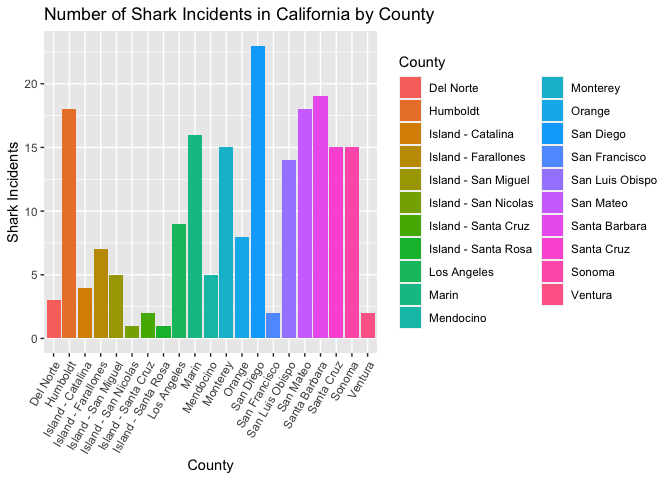
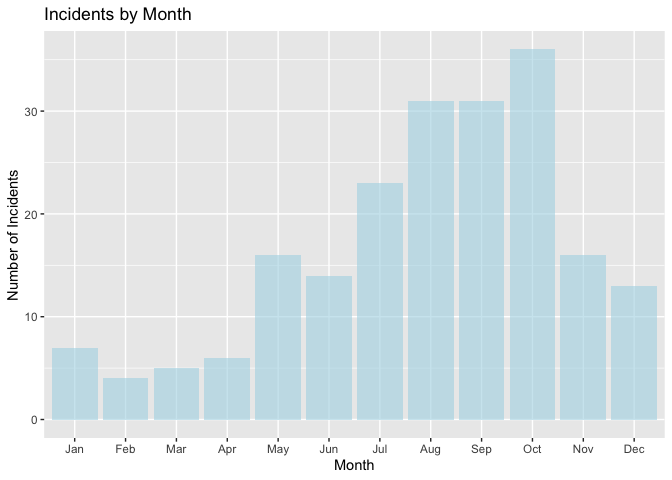
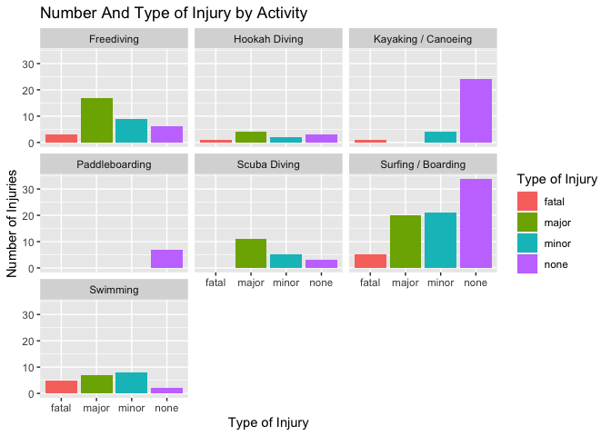
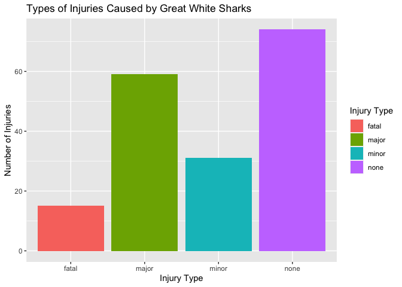
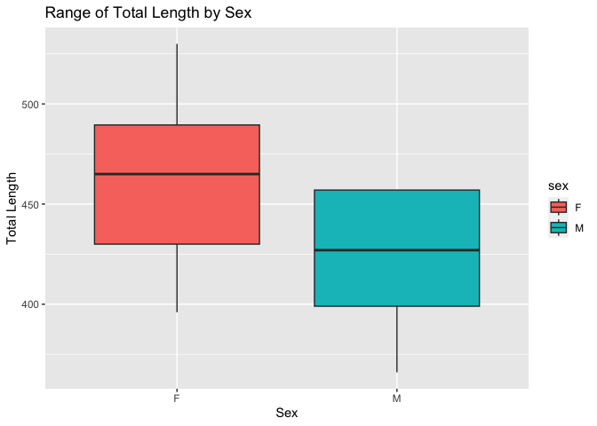

## Instructions
Answer the following questions and complete the exercises in RMarkdown. Please embed all of your code and push your final work to your repository. Your code must be organized, clean, and run free from errors. Remember, you must remove the `#` for any included code chunks to run. Be sure to add your name to the author header above. 

Your code must knit in order to be considered. If you are stuck and cannot answer a question, then comment out your code and knit the document. You may use your notes, labs, and homework to help you complete this exam. Do not use any other resources- including AI assistance.  

Don't forget to answer any questions that are asked in the prompt. Some questions will require a plot, but others do not- make sure to read each question carefully.  

For the questions that require a plot, make sure to have clearly labeled axes and a title. Keep your plots clean and professional-looking, but you are free to add color and other aesthetics.  

Be sure to follow the directions and upload your exam on Gradescope.    

## Background
In the `data` folder, you will find data about shark incidents in California between 1950-2022. The [data](https://catalog.data.gov/dataset/shark-incident-database-california-56167) are from: State of California- Shark Incident Database.   

## Load the libraries

```r
library("tidyverse")
library("janitor")
library("naniar")
```

## Load the data
Run the following code chunk to import the data.

```r
sharks <- read_csv("data/SharkIncidents_1950_2022_220302.csv") %>% clean_names()
```

## Questions
1. (1 point) Start by doing some data exploration using your preferred function(s). What is the structure of the data? Where are the missing values and how are they represented?  
## The missing values are represented by "NA", "unknown", or "not counted." The data is clean and appears to be well organized, although the incident number column is written in a way that's a bit annoying. There are only a couple NAs throughout the data, other than the very last row which has a ton of NAs.


```r
glimpse(sharks)
```

```
## Rows: 211
## Columns: 16
## $ incident_num     <chr> "1", "2", "3", "4", "5", "6", "7", "8", "9", "10", "1…
## $ month            <dbl> 10, 5, 12, 2, 8, 4, 10, 5, 6, 7, 10, 11, 4, 5, 5, 8, …
## $ day              <dbl> 8, 27, 7, 6, 14, 28, 12, 7, 14, 28, 4, 10, 24, 19, 21…
## $ year             <dbl> 1950, 1952, 1952, 1955, 1956, 1957, 1958, 1959, 1959,…
## $ time             <chr> "12:00", "14:00", "14:00", "12:00", "16:30", "13:30",…
## $ county           <chr> "San Diego", "San Diego", "Monterey", "Monterey", "Sa…
## $ location         <chr> "Imperial Beach", "Imperial Beach", "Lovers Point", "…
## $ mode             <chr> "Swimming", "Swimming", "Swimming", "Freediving", "Sw…
## $ injury           <chr> "major", "minor", "fatal", "minor", "major", "fatal",…
## $ depth            <chr> "surface", "surface", "surface", "surface", "surface"…
## $ species          <chr> "White", "White", "White", "White", "White", "White",…
## $ comment          <chr> "Body Surfing, bit multiple times on leg, thigh and b…
## $ longitude        <chr> "-117.1466667", "-117.2466667", "-122.05", "-122.15",…
## $ latitude         <dbl> 32.58833, 32.58833, 36.62667, 36.62667, 35.13833, 35.…
## $ confirmed_source <chr> "Miller/Collier, Coronado Paper, Oceanside Paper", "G…
## $ wfl_case_number  <chr> NA, NA, NA, NA, NA, NA, NA, NA, NA, NA, NA, NA, NA, N…
```


```r
summary(sharks)
```

```
##  incident_num           month             day             year     
##  Length:211         Min.   : 1.000   Min.   : 1.00   Min.   :1950  
##  Class :character   1st Qu.: 6.000   1st Qu.: 7.50   1st Qu.:1985  
##  Mode  :character   Median : 8.000   Median :18.00   Median :2004  
##                     Mean   : 7.858   Mean   :16.54   Mean   :1998  
##                     3rd Qu.:10.000   3rd Qu.:25.00   3rd Qu.:2014  
##                     Max.   :12.000   Max.   :31.00   Max.   :2022  
##                                                                    
##      time              county            location             mode          
##  Length:211         Length:211         Length:211         Length:211        
##  Class :character   Class :character   Class :character   Class :character  
##  Mode  :character   Mode  :character   Mode  :character   Mode  :character  
##                                                                             
##                                                                             
##                                                                             
##                                                                             
##     injury             depth             species            comment         
##  Length:211         Length:211         Length:211         Length:211        
##  Class :character   Class :character   Class :character   Class :character  
##  Mode  :character   Mode  :character   Mode  :character   Mode  :character  
##                                                                             
##                                                                             
##                                                                             
##                                                                             
##   longitude            latitude     confirmed_source   wfl_case_number   
##  Length:211         Min.   :32.59   Length:211         Length:211        
##  Class :character   1st Qu.:34.04   Class :character   Class :character  
##  Mode  :character   Median :36.70   Mode  :character   Mode  :character  
##                     Mean   :36.36                                        
##                     3rd Qu.:38.18                                        
##                     Max.   :41.56                                        
##                     NA's   :6
```


```r
anyNA(sharks)
```

```
## [1] TRUE
```


2. (1 point) Notice that there are some incidents identified as "NOT COUNTED". These should be removed from the data because they were either not sharks, unverified, or were provoked. It's OK to replace the `sharks` object.


```r
sharks2 <- sharks %>% 
  filter(!incident_num=="NOT COUNTED")
```


3. (3 points) Are there any "hotspots" for shark incidents in California? Make a plot that shows the total number of incidents per county. Which county has the highest number of incidents?

## San Diego has the highest number of incidents.


```r
sharks2 %>% 
  select(county, incident_num) %>% 
  group_by(county) %>% 
  summarize(total=n_distinct(incident_num)) %>% 
  ggplot(aes(x=county, y=total, fill=county))+
  geom_col()+
  theme(axis.text.x = element_text(angle = 60, hjust=1))+
  labs(title="Number of Shark Incidents in California by County",
       x="County",
       y="Shark Incidents",
       fill="County")
```

<!-- -->


4. (3 points) Are there months of the year when incidents are more likely to occur? Make a plot that shows the total number of incidents by month. Which month has the highest number of incidents?

## It looks like the majority of incidents happen over the summer, with the most taking place in October.


```r
sharks2 %>% 
  select(county, incident_num, month) %>% 
  group_by(month) %>% 
  summarize(total=n_distinct(incident_num)) %>% 
  ggplot(aes(x=month, y=total))+
  geom_col(fill="lightblue", alpha=0.6)+
  scale_x_discrete(limits=c("Jan","Feb","Mar", "Apr", "May", "Jun", "Jul", "Aug", "Sep", "Oct", "Nov", "Dec"))+
  labs(title="Incidents by Month",
       x="Month",
       y="Number of Incidents")
```

<!-- -->


```r
sharks2$incident_num <- as.integer(sharks2$incident_num)
```


```r
class(sharks2$incident_num)
```

```
## [1] "integer"
```


5. (3 points) How do the number and types of injuries compare by county? Make a table (not a plot) that shows the number of injury types by county. Which county has the highest number of fatalities?  

## San Luis Obispo has the highest number of fatalities (shown in the second table), and San Diego has the highest number of injuries (shown in the first table).

```r
sharks2 %>%
  select(county, incident_num, injury) %>% 
  group_by(county) %>% 
  summarize(total=n_distinct(incident_num)) %>% 
  arrange(desc(total))
```

```
## # A tibble: 21 × 2
##    county          total
##    <chr>           <int>
##  1 San Diego          23
##  2 Santa Barbara      19
##  3 Humboldt           18
##  4 San Mateo          18
##  5 Marin              16
##  6 Monterey           15
##  7 Santa Cruz         15
##  8 Sonoma             15
##  9 San Luis Obispo    14
## 10 Los Angeles         9
## # ℹ 11 more rows
```


```r
sharks2 %>%
  select(county, incident_num, injury) %>% 
  filter(injury=="fatal") %>% 
  group_by(county) %>% 
  summarize(total=n_distinct(incident_num)) %>% 
  arrange(desc(total))
```

```
## # A tibble: 10 × 2
##    county              total
##    <chr>               <int>
##  1 San Luis Obispo         3
##  2 Monterey                2
##  3 San Diego               2
##  4 Santa Barbara           2
##  5 Island - San Miguel     1
##  6 Los Angeles             1
##  7 Mendocino               1
##  8 San Francisco           1
##  9 San Mateo               1
## 10 Santa Cruz              1
```


6. (2 points) In the data, `mode` refers to a type of activity. Which activity is associated with the highest number of incidents?

## Surfing and Boarding have the highest number of incidents associated with them.


```r
sharks2 %>% 
  select(mode, incident_num) %>% 
  group_by(mode) %>% 
  summarize(total=n_distinct(incident_num)) %>% 
  arrange(desc(total))
```

```
## # A tibble: 7 × 2
##   mode                total
##   <chr>               <int>
## 1 Surfing / Boarding     80
## 2 Freediving             35
## 3 Kayaking / Canoeing    29
## 4 Swimming               22
## 5 Scuba Diving           19
## 6 Hookah Diving          10
## 7 Paddleboarding          7
```


7. (4 points) Use faceting to make a plot that compares the number and types of injuries by activity. (hint: the x axes should be the type of injury) 


```r
sharks2 %>% 
  group_by(injury, mode) %>% 
  summarize(total=n_distinct(incident_num)) %>% 
  ggplot(aes(x=injury, y=total, fill=injury))+
  geom_col(position="dodge")+
  facet_wrap(~mode)+
  labs(title="Number And Type of Injury by Activity",
       x="Type of Injury",
       y="Number of Injuries",
       fill="Type of Injury")
```

```
## `summarise()` has grouped output by 'injury'. You can override using the
## `.groups` argument.
```

<!-- -->


8. (1 point) Which shark species is involved in the highest number of incidents?  

## The White shark has the highest number of incidents (I'm assuming it's referring to the Great White Shark).


```r
sharks2 %>% 
  select(incident_num, species) %>% 
  group_by(species) %>% 
  summarize(total=n_distinct(incident_num)) %>% 
  arrange(desc(total))
```

```
## # A tibble: 8 × 2
##   species    total
##   <chr>      <int>
## 1 White        179
## 2 Unknown       13
## 3 Hammerhead     3
## 4 Blue           2
## 5 Leopard        2
## 6 Salmon         1
## 7 Sevengill      1
## 8 Thresher       1
```


9. (3 points) Are all incidents involving Great White's fatal? Make a plot that shows the number and types of injuries for Great White's only.  

## No, the majority of incidents involving Great White's result in no injury, and the fewest result in a fatality.


```r
sharks2 %>% 
  filter(species=="White") %>% 
  group_by(species, injury) %>% 
  summarize(total=n_distinct(incident_num)) %>% 
  ggplot(aes(x=injury, y=total, fill=injury))+
  geom_col()+
  labs(title="Types of Injuries Caused by Great White Sharks",
       x="Injury Type",
       y="Number of Injuries",
       fill="Injury Type")
```

```
## `summarise()` has grouped output by 'species'. You can override using the
## `.groups` argument.
```

<!-- -->


## Background
Let's learn a little bit more about Great White sharks by looking at a small dataset that tracked 20 Great White's in the Fallaron Islands. The [data](https://link.springer.com/article/10.1007/s00227-007-0739-4) are from: Weng et al. (2007) Migration and habitat of white sharks (_Carcharodon carcharias_) in the eastern Pacific Ocean.

## Load the data

```r
white_sharks <- read_csv("data/White sharks tracked from Southeast Farallon Island, CA, USA, 1999 2004.csv", na = c("?", "n/a")) %>% clean_names()
```

10. (1 point) Start by doing some data exploration using your preferred function(s). What is the structure of the data? Where are the missing values and how are they represented?

## There are NAs in "sex" and "maturity", both of which are represented as"NA."


```r
glimpse(white_sharks)
```

```
## Rows: 20
## Columns: 10
## $ shark           <chr> "1-M", "2-M", "3-M", "4-M", "5-F", "6-M", "7-F", "8-M"…
## $ tagging_date    <chr> "19-Oct-99", "30-Oct-99", "16-Oct-00", "5-Nov-01", "5-…
## $ total_length_cm <dbl> 402, 366, 457, 457, 488, 427, 442, 380, 450, 530, 427,…
## $ sex             <chr> "M", "M", "M", "M", "F", "M", "F", "M", "M", "F", NA, …
## $ maturity        <chr> "Mature", "Adolescent", "Mature", "Mature", "Mature", …
## $ pop_up_date     <chr> "2-Nov-99", "25-Nov-99", "16-Apr-01", "6-May-02", "19-…
## $ track_days      <dbl> 14, 26, 182, 182, 256, 275, 35, 60, 209, 91, 182, 240,…
## $ longitude       <dbl> -124.49, -125.97, -156.80, -141.47, -133.25, -138.83, …
## $ latitude        <dbl> 38.95, 38.69, 20.67, 26.39, 21.13, 26.50, 37.07, 34.93…
## $ comment         <chr> "Nearshore", "Nearshore", "To Hawaii", "To Hawaii", "O…
```


```r
anyNA(white_sharks)
```

```
## [1] TRUE
```


11. (3 points) How do male and female sharks compare in terms of total length? Are males or females larger on average? Do a quick search online to verify your findings. (hint: this is a table, not a plot).  

## On average, females are slightly longer. I looked it up after, and it looks like females are in fact longer.


```r
white_sharks %>% 
  select(sex, total_length_cm) %>% 
  group_by(sex) %>% 
  filter(!sex=="NA") %>% 
  summarize(average=mean(total_length_cm))
```

```
## # A tibble: 2 × 2
##   sex   average
##   <chr>   <dbl>
## 1 F        462 
## 2 M        425.
```


12. (3 points) Make a plot that compares the range of total length by sex.


```r
white_sharks %>% 
  group_by(sex) %>% 
  filter(!sex=="NA") %>% 
  ggplot(aes(x=sex, y=total_length_cm, fill=sex))+
  geom_boxplot()+
  labs(title="Range of Total Length by Sex",
       x="Sex",
       y="Total Length")
```

<!-- -->


13. (2 points) Using the `sharks` or the `white_sharks` data, what is one question that you are interested in exploring? Write the question and answer it using a plot or table.

## My question is: How do the number of incidents compare every year since 2000? Make a chart to show how this change, as well as the incidents for each species.


```r
sharks2 %>% 
  select(year, species, incident_num) %>% 
  group_by(year) %>% 
  summarize(total=n_distinct(incident_num)) %>% 
  arrange(desc(total))
```

```
## # A tibble: 63 × 2
##     year total
##    <dbl> <int>
##  1  2007     9
##  2  2004     8
##  3  2017     8
##  4  2020     8
##  5  1974     7
##  6  2012     7
##  7  2014     7
##  8  2015     7
##  9  2021     7
## 10  1959     5
## # ℹ 53 more rows
```


```r
sharks2 %>% 
  select(year, species, incident_num) %>% 
  filter(year>=2000) %>% 
  group_by(year) %>% 
  ggplot(aes(x=year, y=incident_num, fill=species))+
  geom_col(position="dodge")+
  labs(title="Number of Incidents Per Year Per Species Since 2000",
       x="Year",
       y="Number of Incident",
       fill="Species")
```

<!-- -->

